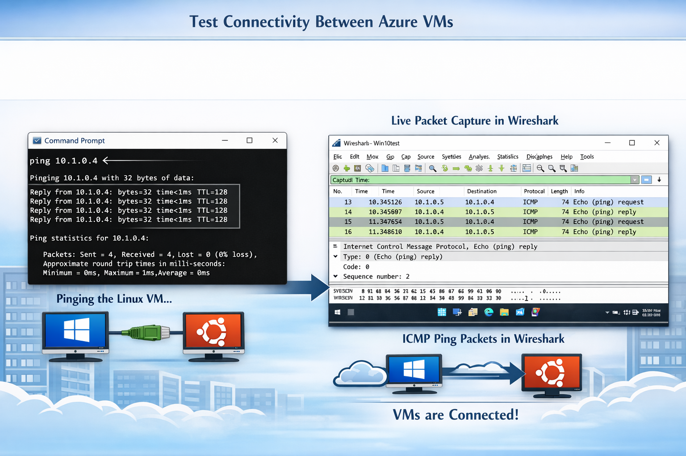

  

# Network Security Groups (NSGs) and Watching Traffic Between Azure Virtual Machines  
*A beginner‑friendly walkthrough with screenshots*

This guide shows you how to watch network traffic between Azure Virtual Machines using **Wireshark**, and how **Network Security Groups (NSGs)** affect what traffic is allowed or blocked.

---

## 🧰 Tools and Technologies Used
- Microsoft Azure (Virtual Machines)
- Remote Desktop (RDP)
- Command‑line tools (PowerShell, Bash)
- Network protocols: ICMP (ping), SSH, RDP, DNS, HTTP/HTTPS
- Wireshark (packet analyzer)

---

## 🖥 Operating Systems Used
- Windows 10  
- Ubuntu Server 20.04

---

# 🧭 High‑Level Steps (Beginner Friendly)

1. **Create two virtual machines** in Azure (one Windows, one Linux).
2. **Install Wireshark** on the Windows VM.
3. **Generate traffic** between the VMs (ping, SSH, web browsing).
4. **Change NSG rules** and watch how traffic changes in Wireshark.

---

# 📸 Step‑by‑Step With Screenshots

---

## **1. Create Two Virtual Machines in Azure**

You will create:
- **Windows 10 VM** (for Wireshark)
- **Ubuntu VM** (for testing SSH and ping)

  

Make sure both VMs are in the **same virtual network** so they can communicate.

---

## **2. Connect to the Windows VM and Install Wireshark**

1. Use **Remote Desktop** to log into the Windows VM.  
2. Download Wireshark from: https://www.wireshark.org  
3. Install it with default settings.

  

---

## **3. Start Capturing Traffic in Wireshark**

1. Open **Wireshark**.  
2. Select your main network adapter.  
3. Click **Start Capture**.

You will immediately see background traffic such as **DNS** and **ARP**.

  

---

## **4. Test Connectivity Between the VMs**

### **Ping the Linux VM from Windows**

  

1. Open **Command Prompt** on the Windows VM.  
2. Type the following command, replacing `<Linux-VM-private-IP>` with your Linux VM’s private IP address:

